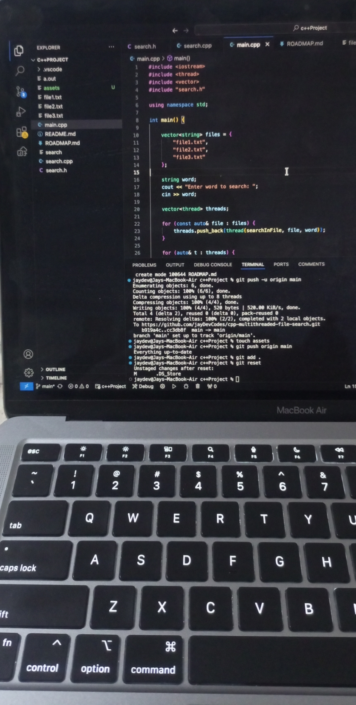
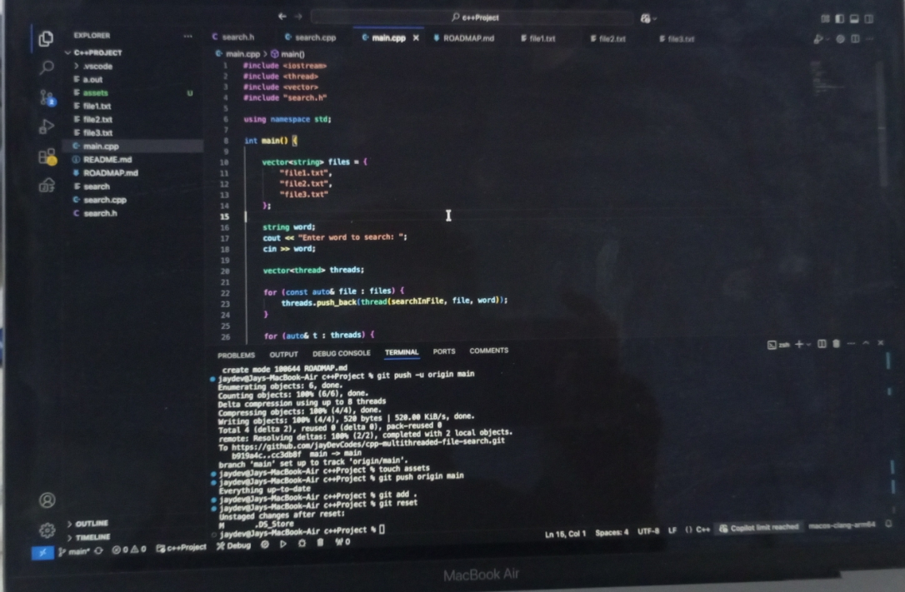

# C++ Multithreaded File Search 🔍

A fast **multithreaded file search tool written in C++** that searches for a word across multiple files simultaneously using threads.

## Features

* Multithreaded file searching
* Fast text lookup across multiple files
* Simple CLI interface
* Lightweight and easy to compile

## Project Structure

```
cpp-multithreaded-file-search
│
├── main.cpp
├── search.cpp
├── search.h
├── file1.txt
├── file2.txt
├── file3.txt
```

## Compilation

Compile the project using:

```
g++ main.cpp search.cpp -o search -pthread
```

## Run the Program

```
./search
```

Then enter the word you want to search.

Example:

```
Enter word to search: hello
```

Output example:

```
file1.txt : Line 1 -> hello world
file2.txt : Line 2 -> hello from github
file3.txt : Line 3 -> hello again
## Demo



```

## Concepts Used

* C++ File Handling
* Multithreading (`std::thread`)
* Vector containers
* CLI programs
* Basic concurrency

## Future Improvements

* Automatic folder scanning
* Regex search
* Colored terminal output
* Performance benchmarking
* Support for thousands of files

## 🤝 Contributing

Pull requests are welcome. Feel free to improve the project.
